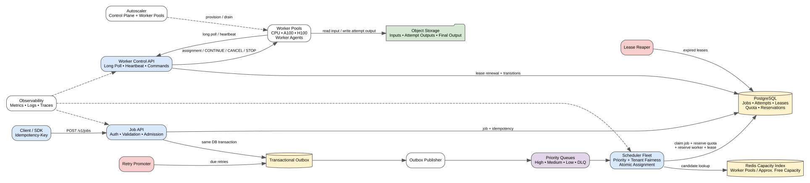
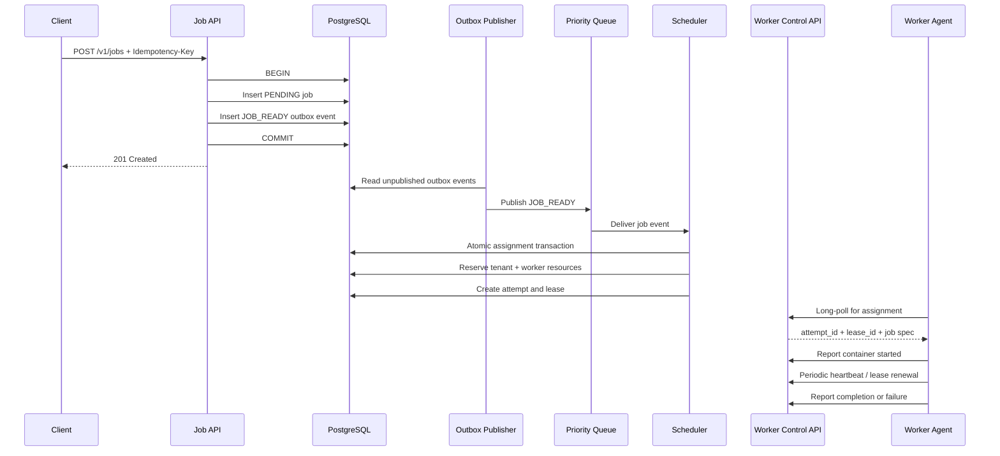
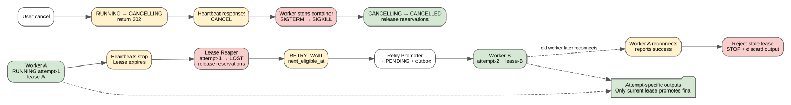
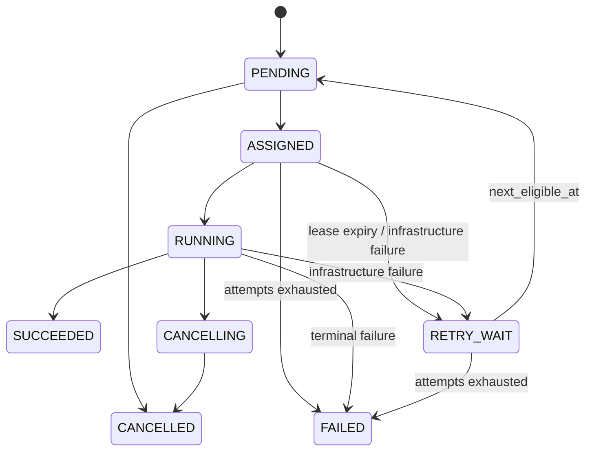

<div align="center">

# ML Job Execution Platform

**A multi-tenant platform for asynchronously executing CPU-, memory-, and GPU-intensive jobs on heterogeneous worker pools.**

[Architecture](#architecture) ·
[Submission](#1-job-submission-and-durability) ·
[Scheduling](#2-priority-fair-scheduling-and-atomic-assignment) ·
[Workers](#3-worker-execution-and-leases) ·
[Reliability](#4-failure-recovery-and-stale-worker-protection) ·
[Trade-offs](#trade-offs)

</div>

---

## Problem statement

Design a platform where tenants submit long-running machine-learning or compute jobs. Each job declares:

- Container image
- Command and environment
- Input and output locations
- CPU and memory requirements
- Optional GPU count and GPU type
- Priority
- Maximum runtime

The system should schedule jobs onto heterogeneous workers, enforce tenant quotas, tolerate worker failure, support cancellation, and scale worker pools according to resource-specific demand.

---

## Requirements

### Functional

- Submit, inspect, list, and cancel jobs
- Support CPU-only and GPU-backed jobs
- Support high, medium, and low priorities
- Enforce per-tenant CPU, memory, GPU, and concurrency quotas
- Retry infrastructure failures
- Treat user-code failures as terminal by default
- Persist attempt history
- Expose eventual-consistent job status reads
- Store inputs and outputs in object storage

### Non-functional

| Requirement | Target |
|---|---:|
| Submission rate | ~200 jobs/second |
| Concurrent running jobs | ~50,000 |
| Pending jobs | Up to ~1,000,000 |
| Typical execution duration | 5 minutes to 3 hours |
| Maximum runtime | 6 hours |
| Accepted job durability | Must not be lost |
| Execution guarantee | At least once |
| Initial deployment | Single region |
| Status-read freshness | Within a few seconds |

---

## Architecture



<details>
<summary><strong>Open the architecture narrative</strong></summary>

The platform consists of five major areas:

1. **Client and API layer** — accepts and validates jobs.
2. **Durable state and messaging** — PostgreSQL, transactional outbox, and priority queues.
3. **Scheduling and control plane** — scheduler, Redis capacity index, Worker Control API, lease reaper, and retry promoter.
4. **Worker data plane** — CPU and GPU worker pools running a worker agent.
5. **Operations** — autoscaling, observability, alerting, and future regional evolution.

PostgreSQL is authoritative for jobs, attempts, leases, quota usage, and worker reservations. Redis is a disposable acceleration layer for candidate search.

</details>

---

## End-to-end flow



---

## 1. Job submission and durability

The Job API performs:

- Authentication and authorisation
- Request validation
- Tenant admission checks
- Rate limiting
- Idempotency enforcement
- Durable persistence

### Idempotency

A unique constraint protects against concurrent duplicate submissions:

```sql
UNIQUE (tenant_id, idempotency_key)
```

A request hash can also be stored:

- Same key and same payload → return the existing job
- Same key and different payload → `409 Conflict`

### Transactional outbox

The database write and queue publication cannot be safely treated as one normal transaction.

The API therefore writes both rows inside one PostgreSQL transaction:

```text
jobs:
  job_id = job-123
  status = PENDING

outbox_events:
  event_type = JOB_READY
  aggregate_id = job-123
  published_at = NULL
```

The API returns `201 Created` only after this transaction commits.

The outbox publisher eventually sends the event to the appropriate queue. Publication is at least once, so the scheduler must tolerate duplicate events.

---

## 2. Priority, fair scheduling, and atomic assignment

The scheduler fleet consumes high-, medium-, and low-priority work using a weighted policy such as:

```text
HIGH HIGH HIGH HIGH HIGH
MEDIUM MEDIUM MEDIUM
LOW
```

The policy skips empty or blocked queues.

Within each priority class, the scheduler applies weighted tenant fairness so one tenant cannot monopolise the system.

### Candidate search

1. Derive the resource shape from the job.
2. Select a compatible worker pool, such as CPU-only, A100, or H100.
3. Query Redis for a bounded candidate set.
4. Prefer an approximate best-fit worker.
5. Confirm and reserve everything in PostgreSQL.

### Atomic assignment transaction

In one PostgreSQL transaction, the scheduler:

1. Confirms the job is still `PENDING`
2. Confirms the job is not cancelled
3. Reserves tenant resource usage
4. Conditionally reserves worker capacity
5. Creates an attempt with a new lease
6. Moves the job to `ASSIGNED`
7. Sets `current_attempt_id`

If any conditional update affects zero rows, the transaction rolls back and the scheduler tries another candidate.

---

## 3. Worker execution and leases

Each worker runs an agent with two primary loops.

### Assignment loop

The worker long-polls:

```http
POST /v1/workers/{worker_id}/assignments/poll?wait_seconds=30
```

The response contains:

```json
{
  "job_id": "job-123",
  "attempt_id": "attempt-2",
  "lease_id": "lease-abc",
  "lease_expires_at": "2026-07-29T10:00:00Z",
  "job_spec": {}
}
```

After starting the container, the worker reports:

```http
POST /v1/workers/{worker_id}/attempts/{attempt_id}/started
```

### Heartbeat loop

A heartbeat reports free capacity and active attempts:

```json
{
  "available_resources": {
    "cpu_millis": 4000,
    "memory_mb": 8192,
    "gpu_count": 0
  },
  "active_attempts": [
    {
      "attempt_id": "attempt-2",
      "lease_id": "lease-abc",
      "local_state": "RUNNING"
    }
  ]
}
```

The response may contain:

```text
CONTINUE
CANCEL
STOP_STALE_ATTEMPT
```

Heartbeats renew valid leases and refresh the Redis worker-capacity index.

### Completion

Completion is reported through a dedicated idempotent endpoint. The control plane accepts it only when:

- Worker identity matches
- Attempt matches `current_attempt_id`
- Lease ID matches
- Lease is still valid
- Attempt is `RUNNING`

Each attempt writes output to an isolated path:

```text
/jobs/job-123/attempts/attempt-2/
```

Only the current valid attempt may promote its output as the official job result.

---

## 4. Failure recovery and stale-worker protection



### Worker loss

When heartbeats stop, the lease eventually expires.

A lease reaper atomically:

1. Marks the expired attempt `LOST`
2. Releases worker capacity
3. Releases tenant usage
4. Applies the retry policy
5. Moves the job to `RETRY_WAIT` or `FAILED`

A retry promoter later moves eligible jobs:

```text
RETRY_WAIT → PENDING
```

and writes a new outbox event.

Each retry creates a completely new attempt and lease. Lease ownership is never transferred.

### Stale workers

During a network partition, an old worker may continue computing while a newer attempt executes elsewhere.

The old worker cannot commit completion because the conditional update checks the current attempt and lease. Its update affects zero rows.

Attempt-scoped output paths prevent the stale worker from overwriting the valid result.

### Retry policy

This design uses:

```text
max_attempts = 3
```

This means three total execution attempts, including the first.

- Infrastructure failures → retry while attempts remain
- User-code failures → terminal by default
- Attempts exhausted → `FAILED`

---

## 5. Cancellation

### Pending job

```text
PENDING → CANCELLED
```

A stale queue message is harmless because the scheduler verifies authoritative state.

### Running job

```text
RUNNING → CANCELLING → CANCELLED
```

Flow:

1. Client calls the cancellation API.
2. The API atomically changes the job to `CANCELLING`.
3. The API returns `202 Accepted`.
4. The next heartbeat response contains `CANCEL`.
5. The worker sends `SIGTERM`.
6. After a grace period, the worker sends `SIGKILL` if required.
7. The worker confirms cancellation.
8. The control plane finalises `CANCELLED` and releases reservations.

If the worker is unreachable, lease expiry and reconciliation complete the recovery according to policy.

---

## Job state machine



---

## Scaling

### Control plane

Horizontally scale:

- Job API
- Job Read API
- Scheduler
- Worker Control API
- Outbox publisher
- Retry promoter

Useful HPA signals:

- CPU and memory
- Request rate
- Queue-consumption lag
- Active long-poll connections
- Scheduling throughput

### Worker fleet

Scale independently by resource pool using:

- Pending CPU demand
- Pending memory demand
- Pending GPU demand by model
- Oldest schedulable-job age
- Current utilisation
- Provisioning capacity already in flight
- Cost and capacity limits

Scale-down uses a `DRAINING` state:

1. Stop assigning new work
2. Wait for active attempts to complete
3. Confirm no active leases
4. Terminate the worker

---

## Backpressure

The platform can continue accepting work while backlog age and storage remain within safe limits.

- Tenant limit exceeded → `429 Too Many Requests`
- Global control-plane overload → `503 Service Unavailable`
- Unschedulable job → remain pending with a reason and next evaluation time
- Queue age and oldest eligible job are more meaningful than queue depth alone

---

## Observability

Capture timestamps for:

```text
submitted_at
persisted_at
event_published_at
scheduler_picked_at
assigned_at
worker_received_at
container_started_at
completed_at
```

Measure:

- API persistence latency
- Outbox delay
- Queue waiting time
- Scheduling latency
- Assignment delivery latency
- Container startup latency
- Total job-start latency
- Execution duration
- Worker utilisation by pool
- Lease-expiry rate
- Retry and failure rate
- Unschedulable jobs by reason
- Provisioning latency
- DLQ depth

Structured logs should include:

```text
job_id
attempt_id
tenant_id
worker_id
lease_id
old_state
new_state
failure_code
```

---

## Trade-offs

<details>
<summary><strong>At-least-once execution versus exactly once</strong></summary>

The design prioritises not losing accepted jobs. During failures or partitions, temporary duplicate execution may occur.

Leases and conditional transitions fence authoritative state, but external side effects still require idempotency or downstream fencing.

</details>

<details>
<summary><strong>Redis versus PostgreSQL</strong></summary>

Redis enables fast candidate lookup but can be stale or unavailable.

PostgreSQL is slower, but remains authoritative for jobs, attempts, leases, quota usage, and worker reservations.

</details>

<details>
<summary><strong>Worker pull versus push</strong></summary>

Long polling gives natural backpressure and works well with ephemeral workers.

The trade-off is a small amount of polling overhead and assignment latency compared with persistent push channels.

</details>

<details>
<summary><strong>Basic fit versus global optimal packing</strong></summary>

The initial system uses bounded candidate lookup and approximate best fit.

It deliberately defers expensive global bin-packing, pre-emption, gang scheduling, and topology-aware GPU placement.

</details>

---

## Failure scenarios

See [docs/failure-scenarios.md](./docs/failure-scenarios.md).

## API contracts

See [docs/api-contracts.md](./docs/api-contracts.md).

## Data model

See [docs/data-model.md](./docs/data-model.md).

## Interview walkthrough

See [docs/interview-walkthrough.md](./docs/interview-walkthrough.md).

---

## Editable diagrams

- [Excalidraw](./diagrams/ml-job-execution-hld.excalidraw)
- [draw.io](./diagrams/ml-job-execution-hld.drawio)
- [Architecture SVG](./diagrams/architecture.svg)
- [Reliability SVG](./diagrams/reliability-flows.svg)

---

## Scope intentionally deferred

- Multi-region active-active execution
- Cross-region job migration
- Pre-emption
- Gang scheduling
- Platform-managed checkpointing
- Predictive autoscaling
- Global optimal bin packing
- GPU topology-aware placement
