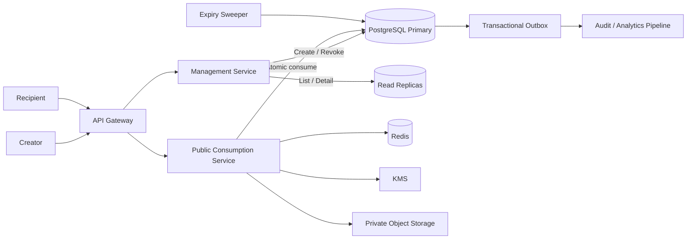

# One-Time Link Service — High-Level Design

A secure, multi-tenant service that allows authenticated users to create links that can be successfully consumed only once.

## Core goals

- Strict at-most-one disclosure
- Strong consistency for consume and revoke operations
- Secure token and content handling
- Protection against preview bots and hot-token bursts
- Horizontal scaling
- Eventual consistency for listing, analytics, and audit projections
- A clear path from single-region to multi-region deployment

## Scale assumptions

| Metric | Assumption |
|---|---:|
| Registered users | 10 million |
| Organisations | 500,000 |
| Active unexpired links | 20 million |
| Daily creations | 3 million |
| Peak creation rate | 1,000 requests/sec |
| Peak consumption rate | 10,000 requests/sec |
| Burst concurrency | 50,000 requests |
| Maximum expiration | 30 days |

## High-level architecture



## Critical correctness rule

```sql
UPDATE one_time_links
SET status = 'CONSUMED',
    consumed_at = now(),
    consumed_request_id = :request_id,
    version = version + 1
WHERE token_hash = :token_hash
  AND status = 'ACTIVE'
  AND expires_at > now()
RETURNING link_id, tenant_id, content_type, payload_reference;
```

Exactly one concurrent request can update one row.

Redis improves performance but never grants ownership.

## Repository contents

- `docs/architecture.md` — detailed HLD
- `diagrams/high-level.mmd` — architecture diagram
- `diagrams/state-machine.mmd` — lifecycle diagram
- `diagrams/consume-sequence.mmd` — concurrent consume sequence

## Suggested repository name

`one-time-link-system-design`
