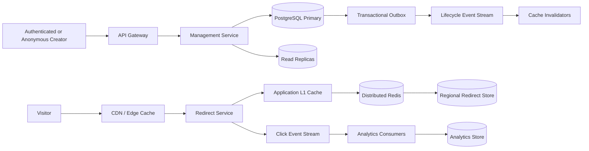

# TinyURL — High-Level System Design

A scalable URL-shortening service supporting anonymous and authenticated users, custom aliases, expiration, link management, viral traffic, click analytics, and multi-region redirects.

## Scale assumptions

| Metric | Assumption |
|---|---:|
| Registered users | 100 million |
| Stored short URLs | 1 billion |
| New links per day | 10 million |
| Peak creation rate | 5,000 requests/sec |
| Peak redirect traffic | 1 million requests/sec |
| Viral-link traffic | 200,000 requests/sec |
| Maximum destination size | 4 KB |

## High-level architecture

## Core design decisions

- Management and redirect traffic are separated into independent services.
- Generated links use random 8-character Base62 codes.
- `UNIQUE(short_code)` is the authoritative collision check.
- Custom alias conflict returns `409`; generated-code collisions are retried internally.
- Redirect path uses CDN → local L1 → Redis → datastore.
- Redirects do not update the link row.
- Click analytics are emitted asynchronously and never block redirects.
- Lifecycle updates use a transactional outbox for cache invalidation.
- One authoritative write region preserves global short-code uniqueness.
- Redirect mappings replicate to regional read stores and caches.

## Repository contents

- `docs/architecture.md` — detailed HLD
- `diagrams/high-level.mmd`
- `diagrams/redirect-sequence.mmd`
- `diagrams/lifecycle-state.mmd`
- `diagrams/multi-region.mmd`

## Suggested repository name

`tinyurl-system-design`
